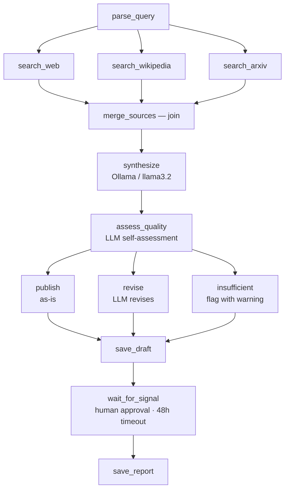

# AI Research Agent

A durable AI research agent built with Sayiir. Given a topic, it searches
multiple sources in parallel, synthesizes findings with a local LLM via
Ollama, routes through a quality gate, and waits for human approval before
saving the final report.

**Zero API keys required** — everything runs locally.

## Why Sayiir for AI pipelines?

Sayiir is not an AI agent framework — it's a **durable workflow engine**.
But many AI "agents" are really pipelines: fetch data, process it, call an
LLM, evaluate quality, wait for a human, save the result. For these, Sayiir
is simpler than agent-specific frameworks:

```python
workflow = (
    Flow("ai-research-agent")
    .then(parse_query)
    .fork()
        .branch(search_web)
        .branch(search_wikipedia)
        .branch(search_arxiv)
    .join(merge_sources)
    .then(synthesize)
    .then(assess_quality)
    .route(extract_verdict, keys=["publish", "revise", "insufficient"])
        .branch("publish", pass_through)
        .branch("revise", revise_report)
        .branch("insufficient", flag_insufficient)
    .done()
    .then(save_draft)
    .wait_for_signal("human_approval", timeout=timedelta(hours=48))
    .then(save_report)
    .build()
)
```

**Where Sayiir shines:** retries with backoff for flaky LLM APIs, parallel
search, conditional routing based on LLM output, human-in-the-loop signals,
and crash recovery for long-running pipelines — all with no infrastructure
and no determinism constraints.

**Where Sayiir is not the right fit (today):** if your agent needs loops
(retry with different strategies) or token streaming. See the
[roadmap](https://docs.sayiir.dev/roadmap/) for what's coming.

## Sayiir features demonstrated

| Feature | How it's used |
|---|---|
| **Fork/join** | Search DuckDuckGo, Wikipedia, and arxiv in parallel |
| **Conditional branching** | Route based on LLM quality assessment (publish / revise / insufficient) |
| **Retries + backoff** | All external calls (search + LLM) with exponential backoff |
| **Timeouts** | 30s per search, 60s for quality assessment, 120s for synthesis |
| **Signals** | Human reviews the draft, then approves or rejects |
| **Durability** | Every step is checkpointed — crash at any point and resume |
| **Pydantic models** | Typed, validated data flowing between every task |

## Workflow



## Prerequisites

1. **Python 3.10+**

2. **Ollama** — local LLM runtime ([ollama.com](https://ollama.com)):

   ```bash
   # macOS
   brew install ollama

   # Linux
   curl -fsSL https://ollama.com/install.sh | sh
   ```

3. **Pull a model** (the example uses llama3.2, ~2 GB):

   ```bash
   ollama pull llama3.2
   ```

4. **Make sure Ollama is running** — it starts automatically on macOS after
   install. On Linux, run `ollama serve` in a separate terminal.

5. **Install Python dependencies**:

   ```bash
   pip install -r requirements.txt
   ```

That's it — no API keys, no accounts, no cloud services.

## Quick start

```bash
python main.py "What are the latest advances in battery technology?"
```

What happens step by step:

1. The query is validated
2. Three searches run **in parallel** (DuckDuckGo, Wikipedia, arxiv)
3. Results are merged into a single source list
4. The local LLM synthesizes everything into a Markdown report
5. The LLM self-assesses quality → routes to **publish** (as-is), **revise** (LLM improves it), or **insufficient** (flagged with warning)
6. The draft is printed to your terminal and saved to `reports/drafts/`
7. You're prompted: `Approve this report? [y/N]`
8. If you approve, the final report is saved to `reports/`

### Options

```bash
# Shorter report
python main.py "Quantum error correction" --depth brief

# More sources per provider (default: 3)
python main.py "CRISPR gene editing" --max-sources 5

# Custom instance ID (useful for resume)
python main.py "Battery tech" --instance-id my-research-001
```

## Production mode (separate processes)

In production with a PostgreSQL backend, the workflow and approval run in
different processes. The draft is saved to disk so a reviewer can inspect it
independently.

```bash
# 1. Start the research workflow — runs searches + synthesis,
#    then parks at the approval signal
python main.py "Battery technology" --instance-id research-001

# 2. In another terminal, review the draft:
cat reports/drafts/battery-technology.json | python -m json.tool

# 3. Approve (reads the draft and sends it as the signal payload):
python send_approval.py reports/drafts/battery-technology.json \
    --instance-id research-001

# 4. Back in the first terminal, resume to save the final report:
python main.py "Battery technology" --instance-id research-001 --resume
```

To reject instead:

```bash
python send_approval.py reports/drafts/battery-technology.json \
    --instance-id research-001 --reject
```

## File structure

```
ai-research-agent-py/
├── main.py            # Workflow definition + CLI entry point
├── tasks.py           # All task implementations (search, synthesize, save)
├── models.py          # Pydantic models (ResearchQuery, SourceResult, etc.)
├── send_approval.py   # Standalone script to approve/reject (production use)
├── requirements.txt   # Python dependencies
└── README.md
```

## Output

```
reports/
├── drafts/
│   └── battery-technology.json              # Draft JSON (for review)
└── battery-technology-20260217-143022.md     # Final Markdown report
```

## Using a different model

To use a different Ollama model, edit the `model` parameter in
`tasks.py:synthesize()`. Any model Ollama supports will work:

```bash
ollama pull mistral        # 7B, good quality
ollama pull phi4           # 14B, strong reasoning
ollama pull llama3.1:8b    # 8B, larger Llama variant
```

Then change `model="llama3.2"` to your preferred model in `tasks.py`.
