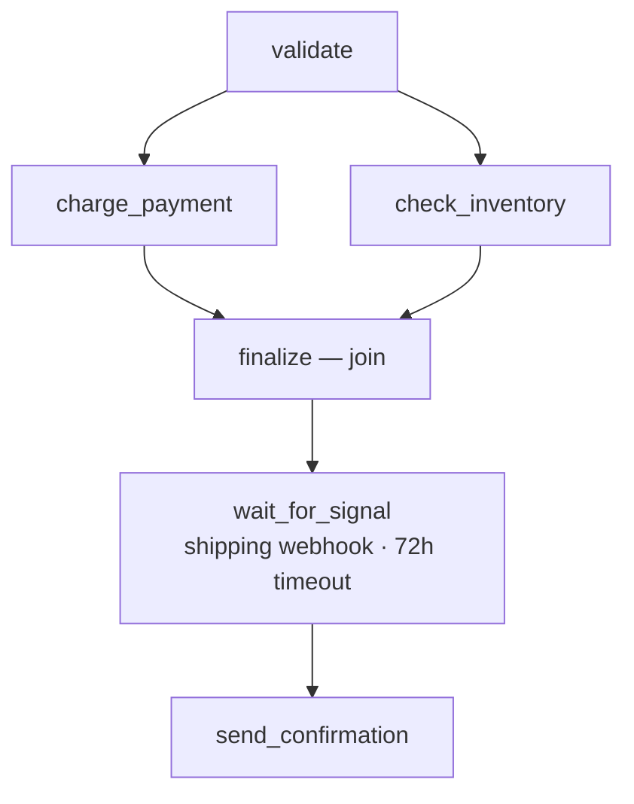

# Order Processing (Node.js)

Order processing pipeline that validates orders, charges payment + checks inventory
in parallel, then **parks until a shipping webhook arrives** before sending confirmation.

Demonstrates fork/join, signals from webhooks, retries, and durable execution.

Matches the [Order Processing tutorial](https://docs.sayiir.dev/tutorials/order-processing-nodejs/).

## Sayiir features demonstrated

| Feature | How it's used |
|---|---|
| **Fork/join** | Charge payment and check inventory in parallel |
| **Retries + backoff** | Payment charges with exponential backoff |
| **Signals** | Shipping provider webhook delivers tracking info |
| **Durability** | Workflow parks in backend while waiting for shipment |

## Workflow



## Prerequisites

- Node.js 20+

## Run

```bash
pnpm install
pnpm start
```

Then simulate a shipping provider webhook:

```bash
curl -X POST http://localhost:3000/webhooks/shipping \
  -H "Content-Type: application/json" \
  -d '{"orderId": "order-1", "trackingNumber": "1Z999AA10123456784", "carrier": "ups"}'
```
