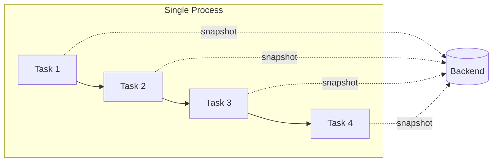
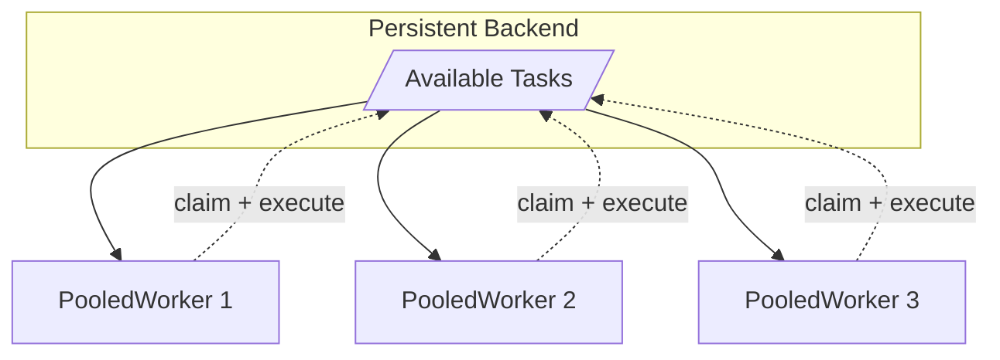
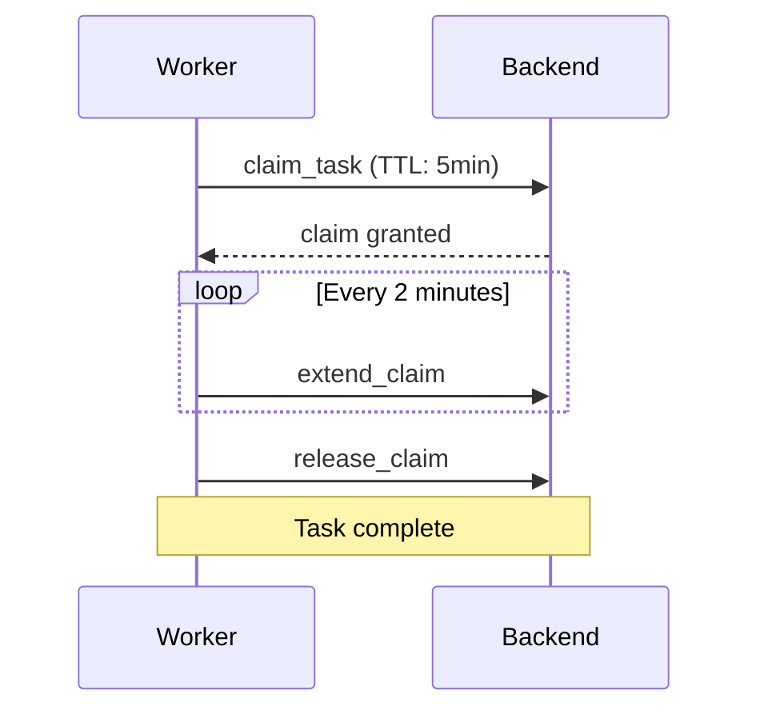
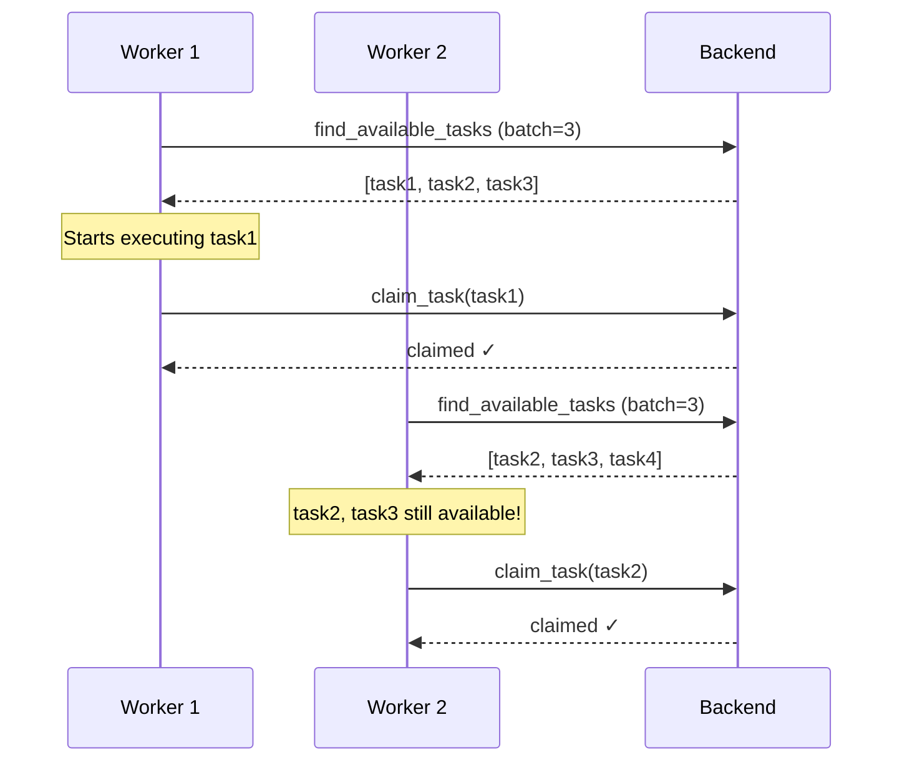
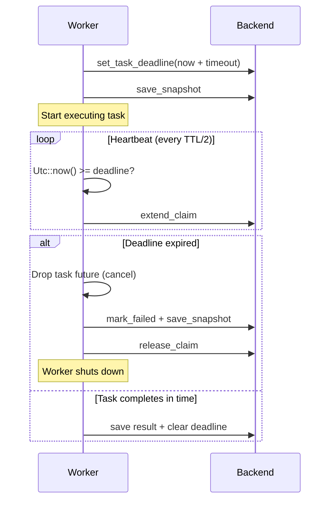

# sayiir-runtime

Runtime execution strategies for durable workflows.

## Execution Strategies

| Strategy | Use Case |
|----------|----------|
| [`CheckpointingRunner`](#checkpointingrunner) | Single-process with crash recovery |
| [`PooledWorker`](#pooledworker) | Multi-worker horizontal scaling |
| [`WorkflowClient`](#workflowclient) | Submit and control workflows without executing tasks |
| `InProcessRunner` | Simple in-memory execution (no persistence) |

---

### CheckpointingRunner

Executes an entire workflow within a single process, saving snapshots after each task. Fork branches run concurrently as tokio tasks.



**When to use:**

- Single-node deployment
- Crash recovery needed (resume from last checkpoint)
- Simple deployment without coordination

**Example:**

```rust
use sayiir_runtime::CheckpointingRunner;
use sayiir_persistence::InMemoryBackend;

let backend = InMemoryBackend::new();
let runner = CheckpointingRunner::new(backend);

// Run workflow with automatic checkpointing
let status = runner.run(&workflow, "instance-123", input).await?;

// Resume after crash
let status = runner.resume(&workflow, "instance-123").await?;
```

---

### PooledWorker

Multiple workers poll a shared backend, claim tasks, and execute them concurrently. Task claiming with TTL prevents duplicate execution.



**When to use:**

- Horizontal scaling across multiple machines
- High throughput requirements
- Fault tolerance (crashed workers' tasks auto-reclaim)

**Example:**

```rust
use sayiir_runtime::PooledWorker;
use sayiir_persistence::PostgresBackend;
use std::time::Duration;

let backend = PostgresBackend::new(pool);
let registry = TaskRegistry::new();

let worker = PooledWorker::new("worker-1", backend, registry)
    .with_claim_ttl(Some(Duration::from_secs(5 * 60)))
    .with_heartbeat_interval(Some(Duration::from_secs(2 * 60)));

// Spawn the worker and get a handle for lifecycle control
let handle = worker.spawn(Duration::from_secs(1), workflows);
// ... later, shut down gracefully ...
handle.shutdown();
handle.join().await?;
```

---

### WorkflowClient

Submits workflows and controls their lifecycle (cancel, pause, unpause, signal, status) without executing tasks. Use this with `PooledWorker` for the distributed model, or standalone for submitting workflows to be picked up by workers.

**When to use:**

- Distributed model — submit workflows from a web server, workers execute elsewhere
- Idempotent submission — conflict policies for duplicate instance IDs
- Lifecycle control — cancel, pause, unpause, signal workflows from any process

**Example:**

```rust
use sayiir_runtime::WorkflowClient;
use sayiir_core::workflow::ConflictPolicy;

let backend = PostgresBackend::<JsonCodec>::connect(url).await?;
let client = WorkflowClient::new(backend)
    .with_conflict_policy(ConflictPolicy::UseExisting);

// Submit — creates a snapshot, does not execute
let (status, output) = client.submit(&workflow, "order-42", input).await?;

// Lifecycle operations
client.cancel("order-42", Some("reason".into()), None).await?;
client.pause("order-42", None, None).await?;
client.unpause("order-42").await?;
let status = client.status("order-42").await?;
```

---

## Comparison

| Aspect | CheckpointingRunner | PooledWorker |
|--------|---------------------|--------------|
| Execution | Single process | Multiple workers |
| Concurrency | Forks run as tokio tasks | Claim-based distribution |
| Scaling | Vertical | Horizontal |
| Coordination | None needed | Via backend claims |
| Failure recovery | Resume from snapshot | Claim expires, task retried |

---

## Task Claiming (PooledWorker)

Workers use a heartbeat mechanism to hold task claims:



**Configuration:**

| Setting | Default | Description |
|---------|---------|-------------|
| `claim_ttl` | 5 minutes | How long a claim is valid |
| `heartbeat_interval` | 2 minutes | How often to extend the claim |
| `batch_size` | 1 | Tasks to fetch per poll |

If a worker crashes, its heartbeat stops and the claim expires, allowing another worker to pick up the task.

---

## Polling vs Claiming

**Important distinction:** Fetching tasks and claiming tasks are separate operations.



- **Fetching** returns task IDs that are currently unclaimed
- **Claiming** happens when execution starts (one task at a time)
- Other workers can "steal" fetched-but-not-yet-claimed tasks
- `batch_size` controls fetch count, not claim count

With `batch_size=1` (default), each worker fetches one task, executes it, then polls again. This minimizes stale task IDs while keeping polling overhead low.

---

## Task Timeouts

Tasks can have a configured timeout duration. When a task exceeds its timeout, the workflow is marked as `Failed` and the task future is cancelled.

### How it works

Timeouts are enforced through **durable deadlines** — an absolute wall-clock timestamp persisted in the workflow snapshot, not an ephemeral in-process timer.



### Enforcement by runner

| Runner | Mechanism | Cancellation |
|--------|-----------|-------------|
| `PooledWorker` | Heartbeat checks persisted deadline | Active — future dropped mid-execution |
| `CheckpointingRunner` | Periodic check of persisted deadline | Active — future dropped mid-execution |
| `InProcessRunner` | `tokio::select!` with sleep | Active — future dropped mid-execution |

### Durable deadline lifecycle

1. **Before execution**: Compute `deadline = now + timeout`, persist in snapshot, save to backend
2. **Deadline refresh**: Right before actual execution starts, recompute `deadline = now + timeout` so snapshot-save I/O doesn't eat into the time budget
3. **During execution**: Periodically check `Utc::now() >= deadline` (piggybacks on heartbeat in distributed mode)
4. **On completion**: Clear deadline from snapshot
5. **On timeout**: Drop future, mark workflow `Failed`, worker shuts down

### Crash recovery

If the process crashes while a task with a deadline is running:

- The deadline is persisted in the snapshot (survives the crash)
- On resume, the expired deadline is detected **before** re-executing the task
- The workflow fails immediately with `TaskTimedOut` — no wasted re-execution

### Cancellation semantics

Cancellation is **cooperative** (standard async Rust). Dropping the task future means:

- The future stops being polled — it won't resume past its current `.await` point
- Drop handlers run, resources are released
- Spawned sub-tasks (`tokio::spawn`) are **not** cancelled — they run independently
- CPU-bound work between `.await` points runs to completion

For typical async tasks (HTTP calls, DB queries, message sends), this provides effective mid-flight cancellation.

### Worker shutdown on timeout

In `PooledWorker`, a task timeout triggers worker shutdown:

1. Heartbeat detects expired deadline
2. Task future is dropped (cancelled)
3. Workflow marked `Failed`, snapshot saved, claim released
4. `execute_task` returns `Err(TaskTimedOut)`
5. Actor loop detects `is_timeout()` and exits gracefully
6. Other workers see `Failed` state and skip the workflow

### Performance

The deadline check is a zero-cost in-memory timestamp comparison (`Utc::now() >= deadline`) that piggybacks on the existing heartbeat timer. No additional I/O is required — the heartbeat already calls `extend_task_claim` on each tick regardless of timeouts. With the default 5-minute claim TTL, the heartbeat fires every 2.5 minutes.

### Configuration

```rust
// Set timeout on a task via the builder
let workflow = WorkflowBuilder::new(ctx)
    .with_registry()
    .then("my_task", |i: u32| async move { Ok(i + 1) })
    .with_metadata(TaskMetadata {
        timeout: Some(Duration::from_secs(300)), // 5 minutes
        ..Default::default()
    })
    .build()?;
```

---

## See Also

- [ROADMAP](https://docs.sayiir.dev/roadmap/) - Alternative claiming strategies and future improvements
