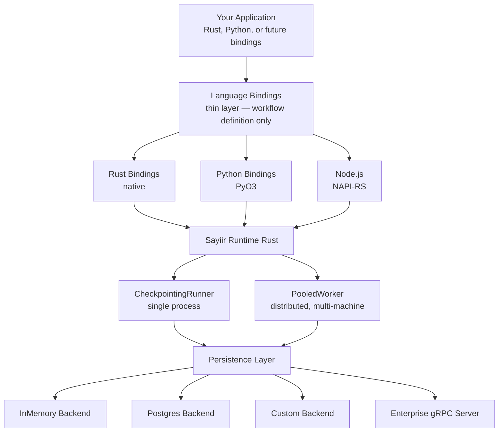
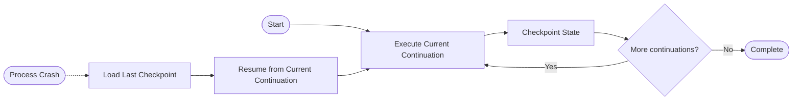

## Layer Overview



:::tip[Full Feature Parity]
All language bindings — Rust, Python, and Node.js — expose the exact same feature set. Sequential and parallel workflows, retries, timeouts, delays, signals, conditional branching, distributed workers, pluggable backends — everything is available in every language. The only variation is in serialization: Rust offers a choice of codecs (JSON, rkyv, or custom), while Python and Node.js use JSON by default. Even this is extensible by design through the pluggable `Codec` trait.
:::

## Core Concepts

### Workflow Definition vs Workflow Instance

A **workflow definition** is the task graph — the DAG of tasks, forks, delays, signals, and retries you build with `Flow` or `WorkflowBuilder`. Internally, this graph is represented as a **continuation tree** (`WorkflowContinuation`): each node explicitly links to its successor(s), and the entire structure is serializable for checkpointing. The definition has a **definition hash** (auto-computed from its structure) that uniquely identifies the shape of the workflow.

A **workflow instance** is a single execution of that definition. When you call `engine.run(workflow, "order-123", ...)`, `"order-123"` is the **instance ID** — a user-provided string that uniquely identifies this run. The same definition can have thousands of concurrent instances, each with its own instance ID and independent state.

```
Definition: fetch_user → send_email         (definition_hash = "a1b2c3")
Instance 1: instance_id = "order-123"       (InProgress, at send_email)
Instance 2: instance_id = "order-456"       (Completed)
Instance 3: instance_id = "order-789"       (Failed)
```

The `instance_id` is the primary key for all persistence — snapshots, signals, task claims. You choose it, so it can be meaningful to your domain (order IDs, user IDs, idempotency keys).

### What is a Run?

A **run** is a single invocation of `engine.run()` or `engine.resume()`. It executes tasks sequentially from the current position until the workflow completes, fails, pauses, parks at a delay, or parks at a signal.

In **single-process mode** (`CheckpointingRunner` / `DurableEngine`), a run executes all tasks in one process. After each task, the snapshot is checkpointed. If the process crashes, call `resume()` to continue from the last checkpoint.

In **distributed mode** (`PooledWorker`), a run is split across multiple workers. Each worker polls for available tasks, claims one, executes it, checkpoints the result, and releases the claim. The next available worker picks up the following task. No single process owns the full execution — workers collaborate through the persistence layer.

Both modes use the same workflow definition, the same persistence traits, and the same snapshot format. The only difference is who drives the execution loop.

## The Checkpoint-Resume Lifecycle (Continuation-Based Execution)



When a workflow runs, Sayiir traverses the continuation tree, executing each task node and advancing to the next continuation. After each task completes, the workflow state — including the current position in the graph — is checkpointed to the persistence backend. If the process crashes, the workflow resumes from the last checkpointed continuation — no replay, no re-execution of completed tasks.

This continuation-based model is what eliminates the need for deterministic code. Your tasks can have side effects, call external APIs, generate random values, or read the system time — because Sayiir never re-executes completed work.

## Hexagonal Design

Sayiir's internals follow hexagonal (ports & adapters) architecture. The core domain (`sayiir-core`) has **zero infrastructure dependencies** — pure business logic. All dependencies flow inward:

```
core ← persistence ← runtime ← language bindings
```

Every integration point is a trait-based port with swappable adapters:

- **`Codec`** — rkyv, JSON, or your own serializer
- **`PersistentBackend`** — InMemory, PostgreSQL, or your own storage
- **`CoreTask`** — closures, registry lookups, or your own execution model
- **`WorkflowRunner`** — single-process, distributed, or your own topology

This isn't accidental. It means you can swap any layer without touching the others. Test with InMemory, deploy with PostgreSQL. Prototype with JSON, optimize with rkyv, or any custom Codec of your choice (protobuf, avro ..). Run single-process locally, distribute across machines in production. Same workflow code, different adapters.

## Pluggable Codecs

Serialization is pluggable — bring your own format or use the built-in options:

```rust
// Zero-copy for maximum performance (default)
let codec = RkyvCodec::new();

// Human-readable for debugging
let codec = JsonCodec::new();

// Custom format (implement Codec trait)
let codec = MyCustomCodec::new();
```

- **rkyv** (default) — Zero-copy deserialization for maximum performance
- **JSON** — Human-readable, enable with `--features json`
- **Custom** — Implement the `Codec` trait for any format (Protobuf, MessagePack, etc.)

## Pluggable Storage Backends

```rust
// In-memory (testing)
let backend = InMemoryBackend::new();

// PostgreSQL (production)
let backend = PostgresBackend::new(pool);

// Custom (bring your own)
impl PersistentBackend for MyBackend { ... }
```

- **InMemory** — For testing
- **PostgreSQL** — For production
- **Custom** — Implement the `PersistentBackend` trait for anything else (Redis, DynamoDB, SQLite, Cloudflare Durable Objects)

## Why Rust?

The core runtime is written in Rust for safety, performance, and correctness — the properties that matter most for infrastructure that runs your critical business processes. But Sayiir is not a Rust-only tool. Python bindings are available today, with TypeScript and Go planned — so you get Rust's reliability without leaving your ecosystem. The binding is a thin layer: you write task functions in your language, Rust handles all orchestration, checkpointing, and execution.

## Performance

Designed to scale to **hundreds of thousands of concurrent activities**:

- **Zero-copy deserialization** with rkyv codec
- **Minimal coordination** — workers claim tasks independently
- **Per-task checkpointing** — fine-grained durability
- **No global locks** — optimistic concurrency

## Distributed Retry Resilience

When a task fails in distributed mode, Sayiir uses **soft worker affinity** to prefer retrying on a different worker. This improves resilience against worker-local failures — corrupted caches, unhealthy dependencies, resource exhaustion, or environment-specific bugs.

### How it works

1. A worker executes a task and it fails (error, timeout, or panic)
2. The worker records the retry in the snapshot, tagging itself as the `last_failed_worker`
3. The task claim is released, making the task available for any worker to pick up
4. When workers poll for available tasks, the backend sorts results so that tasks which did **not** fail on the requesting worker come first

This is a **soft bias**, not a hard exclusion. If the failed worker is the only one available, it will still pick up the task — no work is left stranded. But when multiple workers are polling, tasks naturally migrate away from the worker that failed them.

### Why soft affinity over hard exclusion

- **No starvation** — A single-worker deployment still retries normally
- **Self-healing** — Transient worker issues resolve without manual intervention; the task moves to a healthy worker while the original recovers
- **No configuration** — The bias is automatic; no retry routing rules to maintain
- **Distributed fault isolation** — If Worker A has a bad network path to an external service, retries on Worker B bypass the issue entirely without any operator awareness
